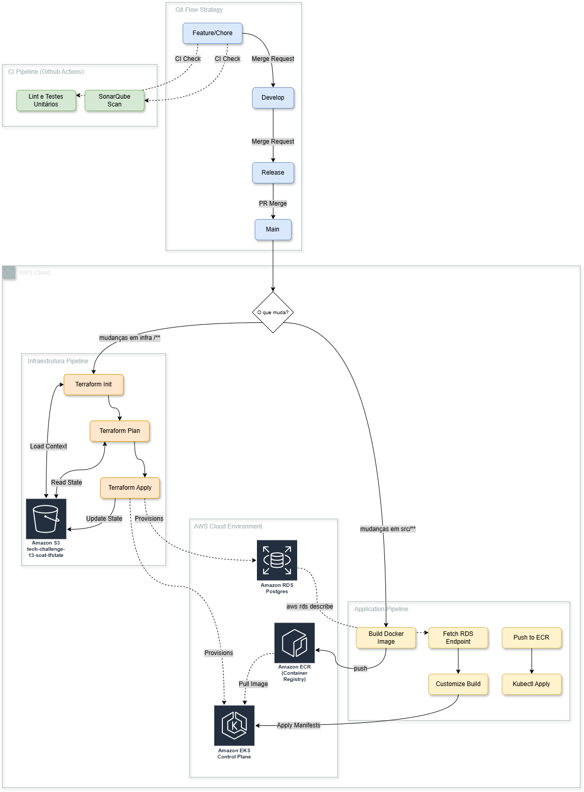

# 🚀 Guia de Deploy - Tech Challenge

Este documento descreve o processo completo de deploy da aplicação na AWS, incluindo a configuração da infraestrutura, build e publicação da aplicação no cluster Kubernetes (EKS).

## 🎓 AWS Academy

**Importante**: Este projeto utiliza o [AWS Academy](https://awsacademy.instructure.com/) para provisionar a infraestrutura e realizar os testes. O AWS Academy fornece um ambiente controlado com acesso a recursos AWS através de roles específicas (LabRole), permitindo que estudantes e desenvolvedores pratiquem e testem suas aplicações em um ambiente real da AWS sem custos diretos.

Para utilizar este projeto, você precisará ter acesso a uma conta do AWS Academy e configurar a variável `AWS_TERRAFORM_ROLE` no seu arquivo `.env` com o ARN da LabRole fornecida pelo AWS Academy.

## 📋 Pré-requisitos

Antes de iniciar o deploy, certifique-se de ter os seguintes softwares instalados e configurados:

- **AWS CLI**: Instalado e configurado com credenciais válidas
  ```bash
  aws --version
  aws configure list
  ```
- **Terraform**: Versão compatível com os módulos utilizados
  ```bash
  terraform --version
  ```
- **Docker**: Para build e push das imagens
  ```bash
  docker --version
  ```
- **Kubectl**: Para gerenciar o cluster Kubernetes
  ```bash
  kubectl version --client
  ```
- **Make**: Para executar os comandos de deploy
  ```bash
  make --version
  ```

## ⚙️ Configuração do Ambiente

### Arquivo .env

Crie um arquivo `.env` na raiz do projeto com todas as variáveis de ambiente necessárias. Este arquivo é essencial para o funcionamento do deploy. Use o `.env.example` para referência. Valores sugeridos para testes:

#### Variáveis de Banco de Dados

```env
DB_HOST=localhost    # Será preenchido automaticamente pelo RDS após o deploy
DB_USER=postgres
DB_PASSWORD=postgres
DB_NAME=garagedb
DB_PORT=5432
DB_SSLMODE=disable
DB_TIMEZONE=UTC
ENV=development
HTTP_ALLOWED_ORIGINS=*

JWT_SECRET=secret
JWT_ACCESS_TOKEN_EXPIRY=12m
JWT_REFRESH_TOKEN_EXPIRY=12m

ADMIN_PASSWORD=Admin123!
ADMIN_EMAIL=admin@admin.com

MAILTRAP_TOKEN=6a45f171cfc233e4edc93d8b847cf19f
MAILTRAP_URL="https://send.api.mailtrap.io/api"

AWS_REGION=us-east-1
AWS_ECR_REPO=soat13-andromeda/tech-challenge

K8S_API_CLUSTER_NAME=tech-challenge-api
```

#### Variáveis AWS que você deve preencher

```env
AWS_ACCOUNT=123456789012                    # ID da sua conta AWS
AWS_TERRAFORM_ROLE=arn:aws:iam::...         # ARN da LabRole do AWS Academy
```

**⚠️ Atenção**: Certifique-se de que TODAS as variáveis estão preenchidas, especialmente as variáveis da AWS, antes de executar o deploy.

## 📁 Estrutura do Projeto

O projeto está organizado da seguinte forma para facilitar o deploy:

- **`infra/`**: Contém todos os arquivos do Terraform
  - `main.tf`: Configuração principal e módulos
  - `modules/network/`: Módulo para criação da VPC e subnets
  - `modules/eks/`: Módulo para criação do cluster EKS
  - `modules/rds/`: Módulo para criação da instância RDS PostgreSQL
  - `outputs.tf`: Outputs da infraestrutura criada
  - `variables.tf`: Variáveis do Terraform

- **`k8s/`**: Contém os arquivos do Kubernetes
  - `base/`: Manifests base (deployment, service, HPA)
  - `overlays/local/`: Configurações para ambiente local (Kind)
  - `overlays/aws/`: Configurações para ambiente AWS (EKS)
  - Utiliza Kustomize para gerenciar as diferenças entre ambientes

- **`apply-terraform.sh`**: Script que automatiza a aplicação do Terraform
  - Executa `terraform init`, `terraform plan` e `terraform apply`
  - Suporta flag `--auto-approve` para execução sem confirmação

- **`Makefile`**: Contém os comandos principais de deploy
  - `make create-tfstate-bucket`: Cria o bucket S3 para armazenar o tfstate
  - `make deploy-aws`: Executa o deploy completo na AWS
  

## 🏗️ Infraestrutura na AWS

A infraestrutura provisionada pelo Terraform inclui:

### EKS (Elastic Kubernetes Service)
- Cluster Kubernetes gerenciado pela AWS
- Node groups configurados para executar os pods da aplicação
- Security groups e IAM roles necessários

### RDS (Relational Database Service)
- Instância PostgreSQL gerenciada
- Configurada em subnets privadas para maior segurança
- Endpoint acessível apenas pelo cluster EKS

### S3
- Bucket para armazenamento do estado do Terraform (tfstate)
- Nome do bucket: `tech-challenge-13-soat-tfstate`
- Versionamento habilitado para backup do estado
- Bloqueio de acesso público configurado

### VPC e Networking
- VPC com CIDR configurável
- Subnets públicas e privadas
- Internet Gateway e NAT Gateway para conectividade

## 🚀 Passos para Deploy

### 1. Criar Bucket S3 para Terraform State

Se o bucket ainda não existir, crie-o executando:

```bash
make create-tfstate-bucket
```

**Nota**: Este passo só precisa ser executado uma vez. Se o bucket já existir, você pode pular esta etapa.

### 2. Executar Deploy

Execute o comando de deploy:

```bash
make deploy-aws
```

Este comando executa automaticamente os seguintes passos:

1. **`apply-terraform`**: Aplica a infraestrutura na AWS
   - Cria/modifica VPC, EKS, RDS e recursos relacionados
   - O script `apply-terraform.sh` é executado com `--auto-approve`

2. **`switch-eck-aws`**: Configura o kubectl para o cluster EKS
   - Executa `aws eks update-kubeconfig` para conectar ao cluster

3. **`deps`**: Instala dependências do cluster
   - Instala o Metrics Server necessário para o HPA

4. **`build-aws`**: Constrói e publica a imagem Docker
   - Faz build da imagem com target `production`
   - Faz login no ECR
   - Faz push da imagem para o repositório ECR

5. **`apply-aws`**: Aplica os manifests Kubernetes
   - Obtém o endereço do RDS automaticamente
   - Aplica os manifests usando Kustomize
   - Atualiza o ConfigMap com o endereço do RDS
   - Reinicia o deployment
   - **Exibe o endpoint do LoadBalancer** ao final

### 3. Aguardar Conclusão

O processo de deploy pode levar vários minutos, especialmente na primeira execução.

**Ao final do processo, o Makefile exibirá automaticamente o endpoint por onde a aplicação está respondendo.**

## 🖼️ Diagramas de Arquitetura

Uma visão rápida da infraestrutura usada para o deploy na AWS é mostrada abaixo. Este diagrama exibe os principais componentes da AWS provisionados pelo Terraform (VPC, subnets públicas/privadas, cluster EKS, grupos de nós, instância RDS, S3 para tfstate e componentes relevantes de IAM/SG). Use isso para entender como os serviços se conectam e onde a aplicação e o banco de dados são executados.



*Figura 1: Diagrama de arquitetura AWS (EKS, RDS, VPC, S3, e componentes relacionados).* 

## ✅ Verificação e Troubleshooting

### Verificar Status do Deploy

Após o deploy, verifique se tudo está funcionando:

```bash
# Verificar pods
kubectl get pods

# Verificar serviços
kubectl get svc

# Verificar deployment
kubectl get deployment tech-challenge-api

# Ver logs da aplicação
kubectl logs -l app=tech-challenge-api --tail=50
```

### Verificar Infraestrutura

```bash
# Verificar cluster EKS
aws eks describe-cluster --name tech-challenge-api --region us-east-1

# Verificar RDS
aws rds describe-db-instances --db-instance-identifier db-garagedb --region us-east-1

# Verificar ECR
aws ecr describe-repositories --repository-names tech-challenge-api --region us-east-1
```

### Problemas Comuns

#### Erro: "Bucket already exists"
- O bucket S3 já existe. Isso é normal se você já executou o deploy anteriormente.
- Solução: Pule a etapa de criação do bucket.

#### Erro: "Cannot assume role"
- A LabRole não está configurada corretamente ou não tem as permissões necessárias.
- Solução: Verifique o ARN da `AWS_TERRAFORM_ROLE` no arquivo `.env`.

#### Erro: "ImagePullBackOff" nos pods
- A imagem não foi encontrada no ECR ou há problema de autenticação.
- Solução: Verifique se o build-aws foi executado com sucesso e se a imagem existe no ECR.

#### Erro: "Cannot connect to database"
- O RDS ainda não está pronto ou o ConfigMap não foi atualizado.
- Solução: Aguarde alguns minutos e verifique se o RDS está disponível. Execute novamente o `make apply-aws` se necessário.

#### Endpoint não aparece
- O LoadBalancer pode estar ainda sendo provisionado.
- Solução: Aguarde alguns minutos e execute:
  ```bash
  kubectl get svc tech-challenge-api-svc
  ```

### Comandos Úteis para Debug

```bash
# Descrever pod para ver eventos
kubectl describe pod <nome-do-pod>

# Ver eventos do namespace
kubectl get events --sort-by='.lastTimestamp'

# Ver configuração do ConfigMap
kubectl get configmap api-config -o yaml

# Ver secrets (valores mascarados)
kubectl get secret api-secrets -o yaml

# Executar comando dentro do pod
kubectl exec -it <nome-do-pod> -- /bin/sh

# Ver logs em tempo real
kubectl logs -f -l app=tech-challenge-api
```

## 🎯 Próximos Passos

Após o deploy bem-sucedido:

1. **Acesse a aplicação**: Use o endpoint exibido pelo Makefile
   ```bash
   curl http://<endpoint-do-loadbalancer>/health
   ```

2. **Acesse a documentação**: 
   - Swagger UI: `http://<endpoint>/docs/index.html`
   - Redoc: `http://<endpoint>/redoc`

3. **Teste a API**: Use o link do API Dog para testar a aplicação.

4. **Monitore a aplicação**: 
   ```bash
   # Ver métricas do HPA
   kubectl get hpa
   
   # Ver uso de recursos
   kubectl top pods
   ```