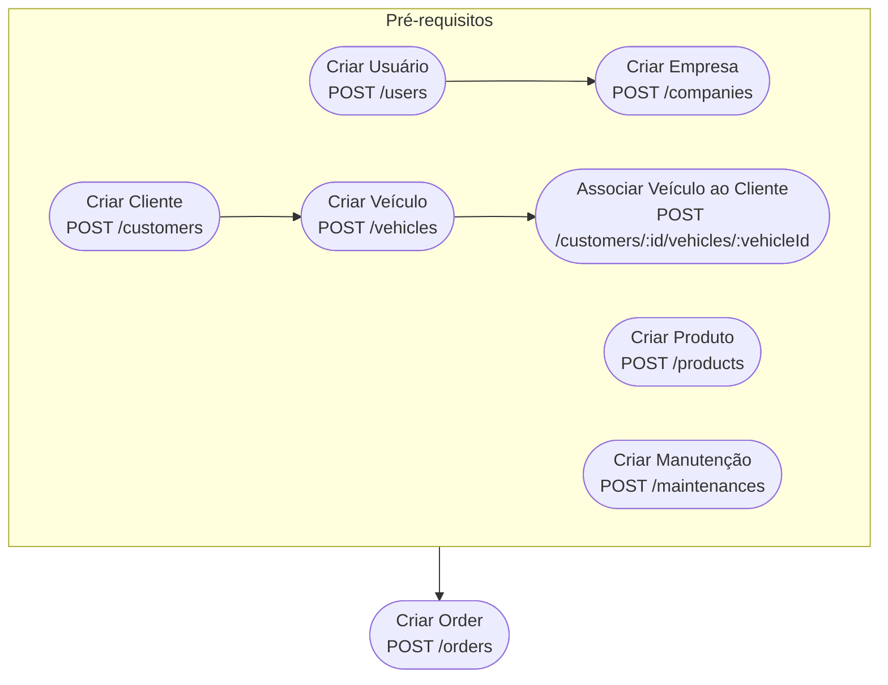
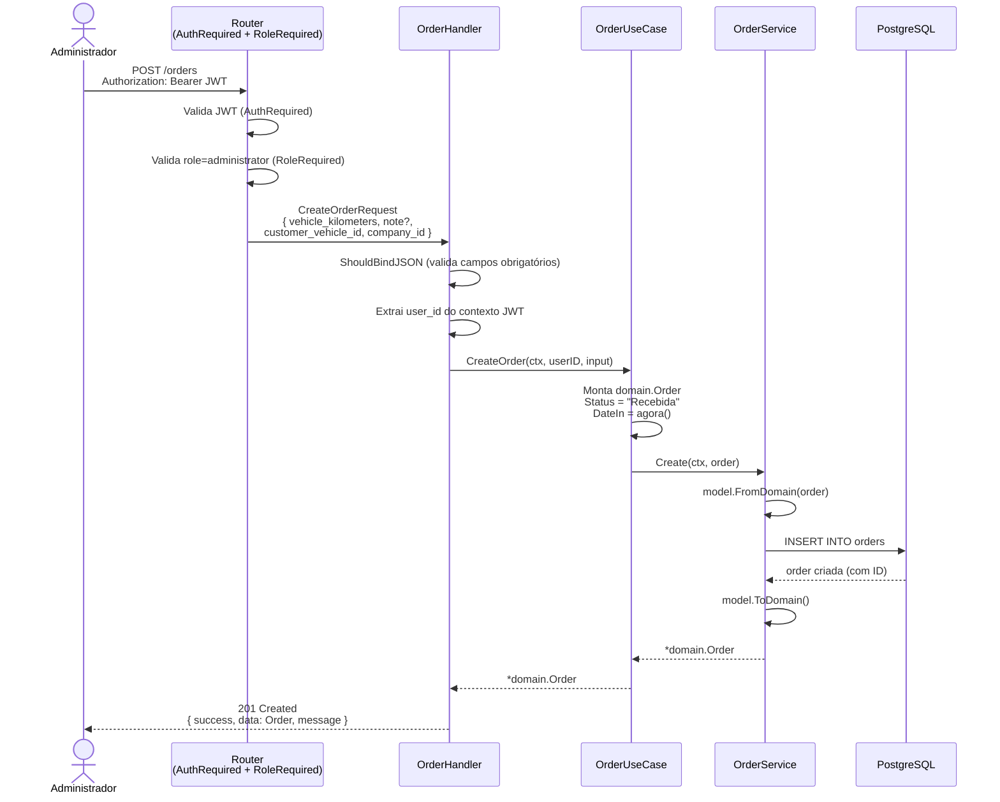
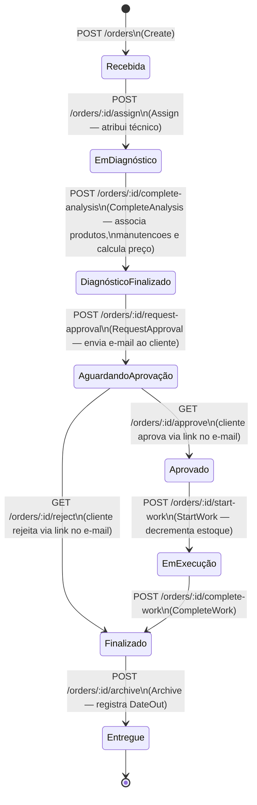
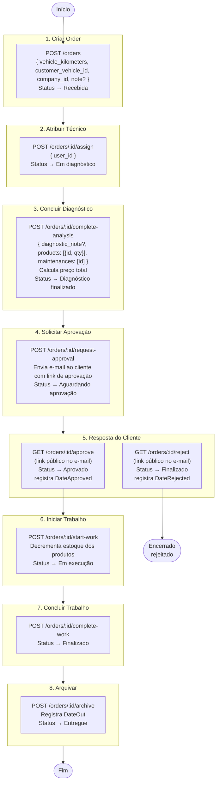
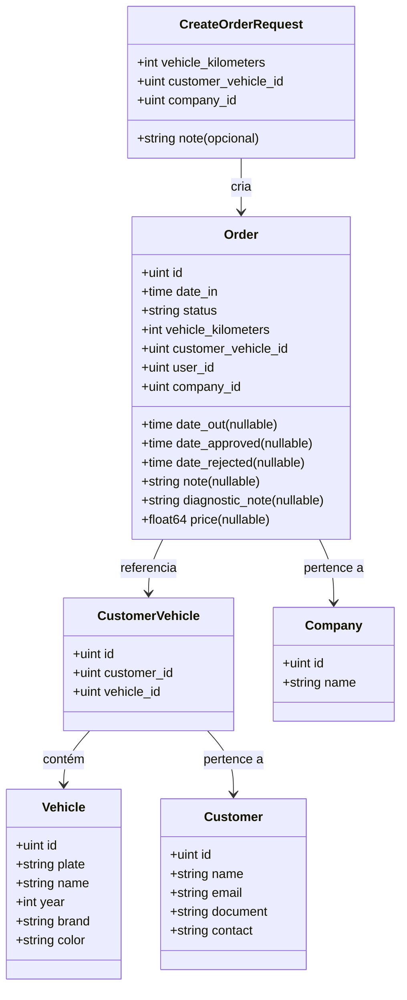

# Fluxo de Criação e Ciclo de Vida de uma Order

## Pré-requisitos

Antes de criar uma order, os seguintes recursos precisam existir no sistema:

---

## Criação da Order

---

## Ciclo de Vida Completo da Order

---

## Fluxo Detalhado Passo a Passo

---

## Estrutura do Payload de Criação

---

## Regras de Negócio

| Etapa | Regra |
|---|---|
| Criação | Status inicial sempre `Recebida`. `DateIn` = momento da criação. |
| Atribuição | Apenas ordens com status `Recebida` podem ser atribuídas. |
| Diagnóstico | Preço calculado automaticamente: `Σ(produto.price × qty) + Σ(manutencao.price)`. |
| Aprovação | E-mail enviado ao cliente com links públicos (sem JWT) para aprovar ou rejeitar. |
| Início do trabalho | Estoque dos produtos é decrementado **somente** nesta etapa. |
| Arquivamento | Registra `DateOut`. Ordens `Finalizado` e `Entregue` são excluídas do `GET /orders`. |
